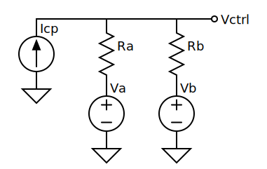

Loop Filter
===========

A discrete-time model for a Type-2 PLL loop filter with clipping.

:Author: Ken Kundert
:Version: 0.0
:Released: 2023-08-31

This loop filter is meant to be embedded in a larger model of a PLL.  The input 
is ``Icp`` and the output is ``Vctrl``.  The parameters are ``C1``, ``C2``, 
``R2`` and ``vdd``.  Primitive time step control is included.  ``up`` and 
``dwn`` are digital signals that indicate that the up or down current sources 
are active.  The filter will take smaller time steps when either is high.

The basic filter topology is:

Over a single time step a capacitor is modeled in discrete time as a series 
voltage source and a resistor.  The voltage on the source is the voltage on the 
capacitor at the beginning of the step and the resistance is ΔT/C.

In the next figure, ``C1`` is replace by its discrete time equivalent, ``Ra`` 
and ``Va``.  Both ``R2`` and ``C2`` are replaced by ``Rb`` and ``Vb``, where 
``Rb`` = ``R2`` + ΔT/``C2``.  ``Vctrl`` is the output voltage at the end of the 
step.

Finally, the ``a`` and ``b`` sides of the filter can be combined:

This is implemented in the following code:

.. code-block:: verilog

    // Loop Filter
    always begin : loopfilter

        // filter
        tprev = t;
        t = $realtime;
        dt = t - tprev;
        Ra = dt/C1;
        Rb = dt/C2 + R2;
        Rt = Ra*Rb/(Ra + Rb);
        Vt = (Rb*Va + Ra*Vb)/(Ra + Rb);
        Vctrl = Icp*Rt + Vt;

        // clipping
        if (Vctrl < 0)
            Vctrl = 0;
        if (Vctrl > vdd)
            Vctrl = vdd;

        // update capacitor voltages
        Va = Vctrl;
        Vb = ((Vt + Rt*Icp - Vb)/Rb)*dt/C2 + Vb;

        // time step control
        if (up || dwn)
            #(500e-12);
        else
            #(30e-9);
    end
